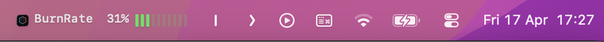
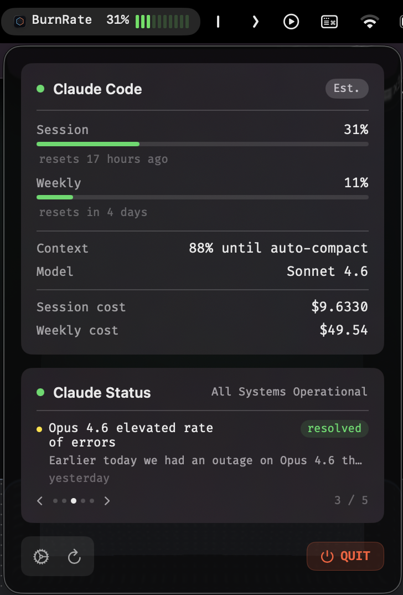

# BurnRate

A lightweight macOS menu bar app that tracks your Claude Code usage in real time — session and weekly rate limits, token costs, context window, and Claude service status.





---

## Features

- **Session & weekly rate limits** — accurate percentages with colour-coded progress bars pulled directly from the Claude Code statusline hook
- **Cost tracking** — session and 7-day rolling cost computed from your `~/.claude/projects` JSONL files
- **Context window** — shows how much context headroom is left before auto-compact kicks in
- **Claude service status** — polls `status.claude.com` every 5 minutes; recent incidents displayed as a swipeable carousel
- **Instant refresh** — file watcher triggers an update the moment a new JSONL entry is written
- **Fira Code UI** — monospace, minimal, dark-mode native

---

## Requirements

- macOS 14 Sonoma or later
- [Claude Code](https://claude.ai/code) installed and signed in
- [Fira Code](https://github.com/tonsky/FiraCode) font installed (optional — falls back to SF Mono)

---

## Installation

### Option 1 — Download the pre-built app (recommended)

1. Go to the [**Releases**](https://github.com/soulreaper02/BurnRate/releases) page.
2. Download the latest `BurnRate.zip`.
3. Unzip and drag **BurnRate.app** to your `/Applications` folder.
4. On first launch macOS will say the app is from an unidentified developer. Open **System Settings → Privacy & Security**, scroll down, and click **Open Anyway**.
5. The BurnRate icon appears in your menu bar. Click it to see your usage.

### Option 2 — Build from source

**Prerequisites:** Xcode 16+, macOS 14+

```bash
git clone https://github.com/soulreaper02/BurnRate.git
cd BurnRate
open BurnRate.xcodeproj
```

1. Select the **BurnRate** scheme and your Mac as the run destination.
2. Press **⌘R** to build and run.

---

## Setup

BurnRate works out of the box for cost and context data. For accurate **rate limit percentages** (session % and weekly %), the Claude Code statusline hook must be installed:

```bash
# Open Claude Code settings and check if statusLine is configured
cat ~/.claude/settings.json | grep statusLine
```

If it isn't set up yet, run this once inside any Claude Code session:

```
/statusline
```

Claude Code will write hook data to `~/Library/Application Support/ClaudeCodexWatch/claude_latest.json` after each response. BurnRate reads this file for live rate limit data.

---

## How it works

| Data | Source |
|------|--------|
| Session % used | Claude Code statusline hook (API-sourced) |
| Weekly % used | Claude Code statusline hook (API-sourced) |
| Context window | Claude Code statusline hook |
| Model name | Claude Code statusline hook |
| Session cost | `~/.claude/projects/**/*.jsonl` token records |
| Weekly cost | `~/.claude/projects/**/*.jsonl` token records |
| Claude service status | `status.claude.com` API (polled every 5 min) |

---

## License

MIT
